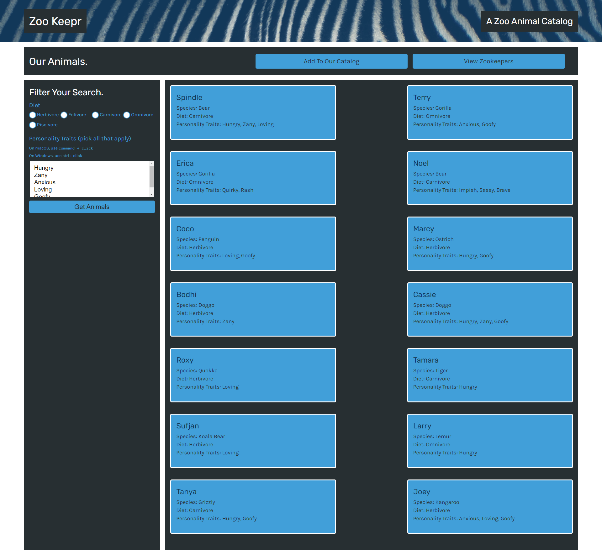

# Zookeepr

## Table of Contents
* [Deployed](#deployed)
* [Technologies](#technologies)
* [Description](#description)
* [Preview](#preview)
* [Questions](#questions)
* [Credits](#credits)

## Deployed
Access the application at https://calm-refuge-78968.herokuapp.com/

## Technologies
* HTML
* CSS
* JavaScript
* Express.js
* Node.js

## Description
This zoo animal catalog is built for the zoo owner who wants to keep track of their current animals and zookeepers. For animals, you can filter your search by diet and personality traits. For zookeepers, search by name or age. On the home page, you can add an animal or a zookeeper, so you can make sure the catalog is always up to date.

## Preview

## Questions
Have questions about this project?  
GitHub: https://github.com/sarawrmas  
Email: sara.m.adamski@gmail.com

## Credits
Sara Adamski